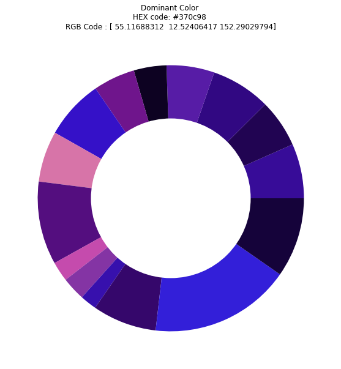
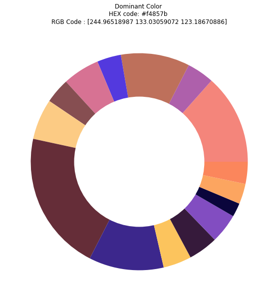

# `Colors Identification in an Image`

The purpose of the project is to identify the colors distribution in an input image.
Peformed **Kmeans Clustering technique** to make groupings of the colors in the image. Then, plotted the distribution using the Pie-Chart.

## Results:
Sample Image:  
</img>
 
Output:  
</img>
 
Sample Image:  
</img>
 
Output:  
</img>